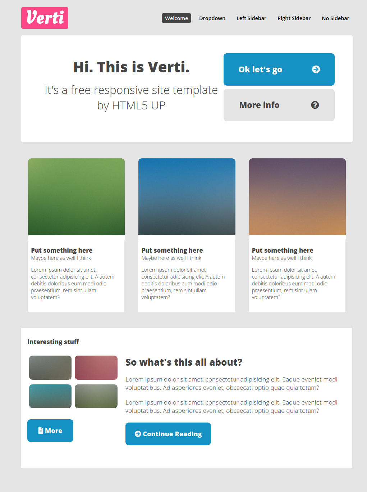

# Verti
Fully responsive website created on bootcamp Coders Lab.

## Instalation

1. Clone the repository: `git clone https://github.com/kostkaczekolady/Verti.git`
2. Install the application: `npm install`
3. Enjoy!

Technologies and tools: HTML, CSS, Gulp, Sass

## [Verti demo](https://kostkaczekolady.github.io/Verti/)
